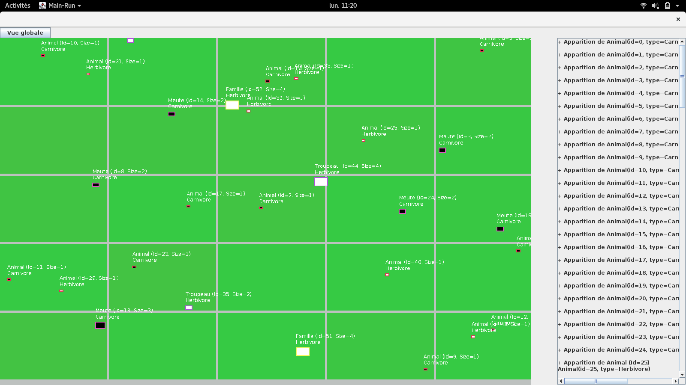
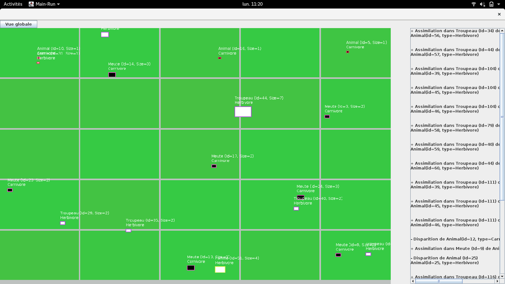
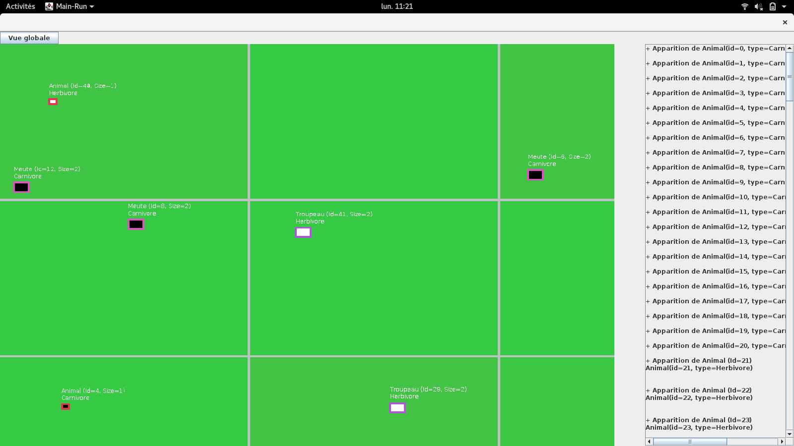
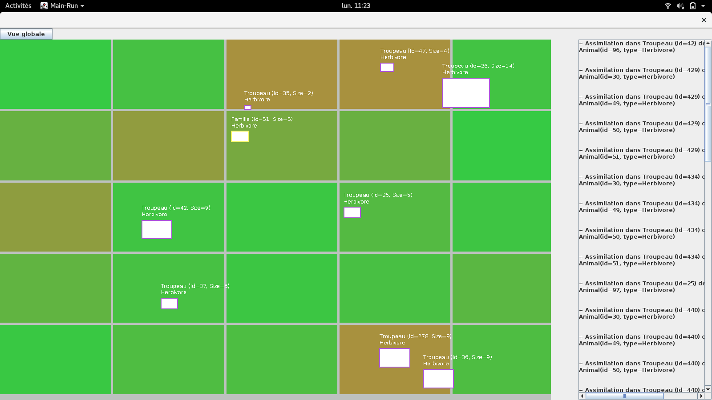

# Predator-Prey simulation

# Sommaire
- [Introduction](#introduction)
- [Interactions between agents](#intercation)
- [Evolution of agent characteristics](#evolution_attributes)  
- [World of the simulation](#world)
- [Graphic interface](#graphic_interface)

## Introduction <a name="introduction"/>

The aim of the project is to partially reproduce the behevior of animals in nature. We focus our simulation around the social capabilities of animals. In other words, we allow agents in our simulation to organize their moves in groups of animals. For that purpose we desscoiate three types of groups :

- Familly made of a "father" (independent of his sex) who must bring back the needed food for the whole family, a "mother" who must protects children, and obviously the children. A family can be entirely made of herbivorous or carnivorous animals.
- Pack made of a chief who takes all the decision for the group and members of the pack. The pack is exclusively composed of carnivorous animals.
- Herd for herbivorous animals in which there is no hierarchy between members of the group.

In the simulation animals interact with other animals eclusively through their group (a single carnivorous animal is represented by a pack of one element, the chief, and a herbivorous animal is represented by a herd of one element).

## Interaction between groups  <a name="intercation"/>

An animal is mainly described by the following attributes :

- his strength 
- his agility
- his aggressivity
- his sociability
- his age
- his vital energy, which can be seen as a life gauge

All these attributes are represented by a real between 0. and 1. (where 1 is the maximum possible value).

There is no predetermined food chain : animal will fight with other animal according to their own attributes. The issue of a fight will be determine by the attributes of the two animal. And for a group, which in a certain maner extends animals, attributes will be take in consideration accroding to the type of group (for example for a family the strength of the group is the strength of the father and for a pack it is the sum of strength of all the members).
Following these attributes group will interact as animal can do : they can merge together, fight each pother, or avoid each other.

Finally, animals inside a group continue to interact with each other. For example, two animal inside a group can create a new family which will remain inside that group.

## Evolution of the attributes <a name="evolution_attributes"/>

At each iteration of the simulation animals will lose energy (because their body cosumes ressources). Below a threshold, animal will have to find food (vegetal ressources for herbivorous, and other animals for carnivorous). By eating ressources, animals will increase their vital energy.

Below another threshold, attributes of animal will be changed (for example strength and agility will be decreased, while aggressivity will be increased). These changes will remain until the animal find food, then modified attributes will slowly come back to the normal.
Following the age of an animal, attributes will also be changed : for a teenager attributes will be increased (like the strength) and for an old animal, attributes will be decreased.

Moreover, an animal has the possibility to espace a fight with another animal. In that case, attributes will be boosted and will rapidly come back to normal. That change allows the animal to run faster for example.

## The world <a name="world"/>

The world is made of cells that represent a certain area, then inside a cell groups can move (and groups can move to another cell). The cell help us to find faster with which group another in a cell can interact with.
The cell also could contains obstacles that groups can avoid or pass following their attributes.

## Graphical interface <a name="graphic_interface"/>

The basis graphical interface is composed the 2D-map which show alive groups , and a log area which shows interaction between groups. User can zoom in the map with the mouse wheel and move with the arrows.

### Main interface :

### Association of animals in groups :
Animals are represented by a square with border on the map. 
- The borders represent the type of group (Family, pack, herd)
- The inside of the square represents the diet of the group (white for herbivorous or black for carnivorous)

### Zoom in the map :

### Evolution of the world:
Fully filled in vegetal resources cell is represented with the color green, and an empty cell in brown

